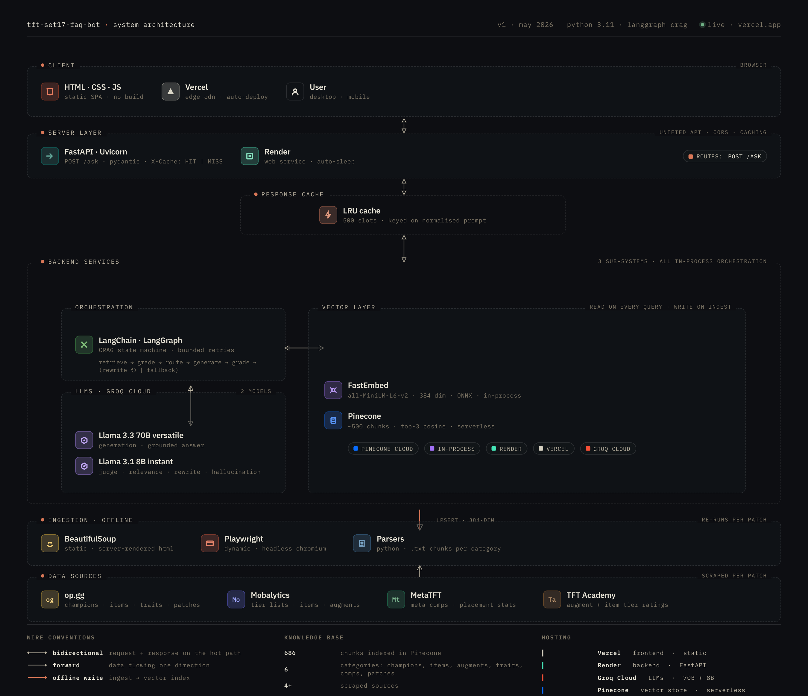

# TFT Set 17 FAQ Chatbot

A full-stack RAG chatbot for Teamfight Tactics Set 17. Ask questions in plain English about champions, items, augments, traits, meta comps, and patch notes.

**Live demo:** [tft-set17-faq-chatbot.vercel.app](https://tft-set17-faq-chatbot.vercel.app/)

---

## Architecture

---

## How It Works

### Ingest (offline, re-runs per patch)

Playwright and BeautifulSoup scrapers pull raw game data from 4+ sources. Parsers convert it to structured `.txt` chunks saved in `data/processed/`, which are then embedded with FastEmbed (MiniLM-L6-v2, 384-dim, ONNX) and upserted into Pinecone.

### Query (live)

1. Request hits FastAPI on Render — input is validated with Pydantic
2. Normalised prompt checked against a 500-slot in-memory LRU cache (`X-Cache: HIT` returned immediately if found)
3. On a cache miss the CRAG pipeline runs:
   - **Retrieve** — embed query, pull top-3 chunks from Pinecone by cosine similarity
   - **Grade documents** — Llama 3.1 8B scores each chunk as relevant or not
   - **Route** — if relevant chunks found, go to generate; otherwise rewrite the query and retry (bounded retries), or fall back to a no-context response
   - **Generate** — Llama 3.3 70B produces a grounded answer from the relevant chunks
   - **Grade answer** — Llama 3.1 8B checks for hallucinations; if found and retries remain, rewrites and re-retrieves
4. Answer cached and returned to the static frontend on Vercel

---

## Tech Stack

| Layer | Technology | Detail |
| --- | --- | --- |
| LLM — generation | Groq · Llama 3.3 70B versatile | Grounded answer synthesis |
| LLM — judge | Groq · Llama 3.1 8B instant | Doc relevance · rewrite · hallucination grading |
| Orchestration | LangGraph + LangChain | CRAG state machine · bounded retries |
| Vector store | Pinecone (serverless) | ~500 chunks · top-3 cosine similarity |
| Embeddings | FastEmbed · MiniLM-L6-v2 | 384-dim · ONNX · in-process on Render |
| Response cache | In-memory LRU (500 slots) | Keyed on normalised prompt · `X-Cache` header |
| Backend | FastAPI + Uvicorn on Render | REST API · Pydantic validation · CORS |
| Frontend | HTML · CSS · JS (static SPA) | Deployed to Vercel edge CDN |
| Scraping | Playwright + BeautifulSoup | Dynamic (Playwright) + static (BS4) sources |

---

## Evaluation

Evaluated with [RAGAS](https://github.com/explodinggradients/ragas) across 30 TFT Set 17 questions covering items, traits, augments, champions, comps, and gameplay mechanics.

| Metric | Score | What it measures |
| --- | --- | --- |
| Faithfulness | 0.89 | Answer is grounded in retrieved context |
| Context Precision | 0.78 | Retrieved chunks are relevant to the question |
| Context Recall | 0.60 | Retrieved chunks cover the ground truth answer |

---

## Knowledge Base

686 chunks across 6 categories scraped from 4+ sources.

| Category | What was collected | Source | Method |
| --- | --- | --- | --- |
| **Champions** | Name, cost, traits, ability descriptions, recommended items | op.gg | BeautifulSoup |
| **Items** | Component + combined items, stats, S/A/B/C tier ratings | Mobalytics · TFT Academy | BeautifulSoup |
| **Augments** | Silver, gold, prismatic augments with descriptions and tier ratings | Mobalytics · TFT Academy | BeautifulSoup |
| **Traits** | Origin and class synergies with breakpoint effects | op.gg | BeautifulSoup |
| **Meta Comps** | Top compositions, unit lists, trait activations, item builds, placement stats | MetaTFT | Playwright |
| **Patch Notes** | Set 17 patch changes, buff/nerf summaries | op.gg | BeautifulSoup |

**Playwright** was used for MetaTFT specifically because composition data is loaded dynamically via JavaScript — a static scraper cannot access it. All other sources were scraped with **BeautifulSoup** against server-rendered HTML.
